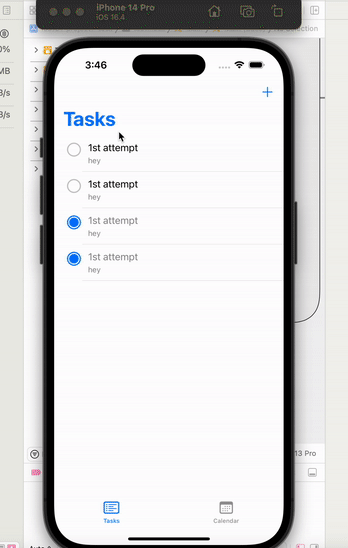

# Project 7 - *Task_List*

Submitted by: **Tamara Regalado Quiroz**

**Task_List** is an app that allows you to add tasks, with its corresponding dates and it allows you to see your tasks in a calendar view and allows you to mark them complete and incomplete

Time spent: 12 hours spent in total

##  Features
- [x] App displays a list of tasks
- [x] Users can add tasks to the list
- [x] Session persists when application is closed and relaunched (tasks dont get deleted when closing app) 
  - [x] Note: You have to quit the app, not minimize it, in order to see the persistence.
- [x] Tasks can be deleted
- [x] Users have a calendar view via navigation controller that displays tasks    
- [x] Tasks can be toggled completed
- [x] User can edit tasks by tapping on the task in the feed view

## Video Walkthrough

Here is a reminder on how to embed Loom videos on GitHub. Feel free to remove this reminder once you upload your README. 

## Notes

Describe any challenges encountered while building the app.
I encountered challenges like not being able to understand the syntax of the task fucntioning

## License

    Copyright [2023] [Tamara Regalado Quiroz]

    Licensed under the Apache License, Version 2.0 (the "License");
    you may not use this file except in compliance with the License.
    You may obtain a copy of the License at

        http://www.apache.org/licenses/LICENSE-2.0

    Unless required by applicable law or agreed to in writing, software
    distributed under the License is distributed on an "AS IS" BASIS,
    WITHOUT WARRANTIES OR CONDITIONS OF ANY KIND, either express or implied.
    See the License for the specific language governing permissions and
    limitations under the License.
